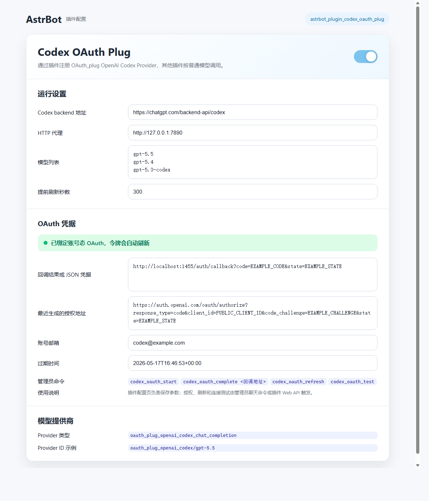

# astrbot_plugin_codex_oauth_plug

> [!IMPORTANT]
> 本插件提供 OpenAI Codex OAuth 账号态 Provider Source 能力。相关方法参考 OpenClaw 的 Codex OAuth 实现思路。OAuth 授权方式本身属于公开客户端授权模型，但实际使用仍需由使用者自行确认并遵守 OpenAI、AstrBot、部署平台及所在地区的相关规则。因使用本插件产生的账号、服务、费用、数据、封禁、合规或其他问题，均由使用者自行承担，本插件作者和贡献者不承担任何责任。

AstrBot 的 Codex OAuth Provider 插件。插件会注册一个普通聊天模型提供商，其他插件和 AstrBot 本体可以按标准 provider 调用，无需处理 OAuth token。

当前插件可以正常运行，有些功能是和AI大人合作的，还在实验中，欢迎反馈。

本项目与 AstrBot 社区需求 [AstrBotDevs/AstrBot#5206: [Feature] 支持 OpenAI OAuth](https://github.com/AstrBotDevs/AstrBot/issues/5206) 相关。

Provider 类型：

```text
oauth_plug_openai_codex_chat_completion
```

名称中保留 `oauth_plug_` 前缀，用来和 AstrBot 本体或其他插件提供的 OAuth 实现区分。

## 配置示意



## 使用方式

1. 安装并启用插件。
2. 在插件配置中填写代理和模型列表，例如 `http://127.0.0.1:7890`、`gpt-5.5`。配置页主要用于查看状态、填写参数和检查最近生成的授权信息。
3. 管理员发送 `codex_oauth_start` 获取授权地址。
4. 在浏览器完成 OpenAI 登录后，复制完整回调 URL。
5. 管理员发送 `codex_oauth_complete <完整回调地址>` 完成绑定。
6. 在模型提供商页面新增类型为 `oauth_plug_openai_codex_chat_completion` 的模型，然后按普通模型使用。该 provider 同时声明 `image_generate` 和 `image_edit`，其他插件可通过 provider 实例调用 `generate_image()` 进行文生图和参考图编辑。


模型列表按行填写，用于提供商配置页面的标题（实际以提供商配置页面为准）。默认示例：

```text
gpt-5.5
gpt-5.4
gpt-5.3-codex
```

## 插件接口

### 聊天命令

以下命令默认需要 AstrBot 管理员权限。实际使用时需按当前 AstrBot 唤醒前缀发送，例如默认配置下使用 `/codex_oauth_start`。

```text
codex_oauth_start
codex_oauth_complete <完整回调地址/code#state/Codex auth.json>
codex_oauth_refresh
codex_oauth_test
```

`codex_oauth_start` 会生成授权地址，并写入配置中的 `last_authorize_url`。`codex_oauth_complete` 完成绑定后会清空临时授权字段。`codex_oauth_test` 会发送一次最小 Codex backend `/responses` 请求，并返回端侧延迟。

### 生图调用

其他插件需要调用 OAuth 生图能力时，可从 AstrBot context 取得 provider 实例，再检查能力字段并调用 `generate_image()`：

```python
provider = context.get_provider_by_id(provider_id)
# 也可以使用当前会话正在使用的 provider：
# provider = context.get_using_provider(event.unified_msg_origin)

if not provider or not getattr(provider, "capabilities", {}).get("image_generate"):
    raise RuntimeError("当前 provider 缺少生图能力")

images = await provider.generate_image(
    prompt="根据参考图重绘背景",
    model="gpt-5.5",
    size="1024x1024",
    n=1,
    reference_images=["/tmp/reference.png"],
)
```

`provider_id` 取模型服务提供商页面中的实际 provider ID。`reference_images` 支持本地文件路径、`file://` 路径、HTTP 图片地址和 `data:image/...`；传入参考图时默认使用图片编辑请求，未传参考图时默认使用文生图请求。`action` 可显式传入 `generate`、`edit` 或 backend 支持的其他取值。

返回值是图片结果对象列表，常用字段为：

```python
image.path
image.mime_type
image.revised_prompt
image.raw
```

`path` 指向已经写入磁盘的生成图片文件。`generated_image_dir` 可在插件高级配置中指定保存目录；留空时，图片会保存到 AstrBot data 下的 `generated/oauth_plug_openai_codex_images`。

### Web API

```text
POST /api/plug/oauth-plug-openai-codex/start
POST /api/plug/oauth-plug-openai-codex/complete
POST /api/plug/oauth-plug-openai-codex/refresh
POST /api/plug/oauth-plug-openai-codex/test
POST /api/plug/oauth-plug-openai-codex/disconnect
```

`refresh` 用于手动刷新令牌。正常模型调用时，插件也会在 token 即将过期或遇到 `401/403` 时自动刷新。

当前 AstrBot 插件配置 schema 以表单渲染为主，授权、刷新和测试通过管理员聊天命令或 Web API 触发。

## 实现参考

本项目参考 OpenClaw 对 Codex OAuth 的使用方式，将 OAuth 登录、token 刷新和 Codex backend `/responses` 请求组织为 AstrBot provider source。插件不会把 OAuth access token 当成普通 OpenAI API Key 使用，模型请求会携带账号态所需的 `chatgpt-account-id`、`originator` 等字段。

OpenClaw 相关文档：

```text
https://docs.openclaw.ai/concepts/oauth
```

## 免责声明

本插件仅提供技术实现。使用者需要自行确认 OpenAI 账号、Codex OAuth、ChatGPT Codex backend、AstrBot 部署环境和相关网络环境的使用是否符合各自服务条款、政策、费用规则和当地法律法规。

本插件不保证相关服务长期可用，不保证接口行为保持稳定，也不保证适用于任何特定用途。因安装、配置、调用、二次开发或公开部署本插件产生的任何账号、数据、费用、服务可用性、合规或其他后果，均由使用者自行承担。本插件作者和贡献者不承担任何责任。

## 开发状态

当前版本用于验证插件化 Provider 方案。接口和配置项后续可能随 AstrBot 插件框架能力变化继续调整。
